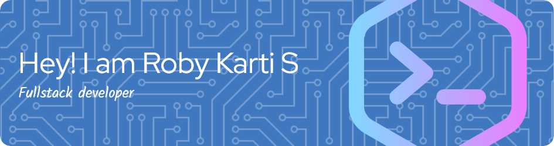

  

  # Hi there, I'm Roby Karti S 👋
  
  **Full-Stack & Mobile Developer | Pekanbaru, Indonesia**
  
  Passionate about crafting scalable web applications, robust backends, and responsive user experiences.

  <!-- Social Badges -->
  
  

---

### 💫 About Me

- 📍 Based in **Pekanbaru, Indonesia**.
- 💻 Building modern web and mobile apps using **Go, React, Next.js, Laravel, and TypeScript**.
- ⚙️ Focused on high concurrency, clean architecture, and high-performance microservices.
- 🌱 Continuously expanding skills in cloud deployments, distributed systems, and modern UI tooling.

---

### 💻 Tech Stack

  
<b>Languages & Core</b>

   
  

    
    
    
    
    
    
    
  

  
<b>Frontend & UI Frameworks</b>

   
  

    
    
    
    
    
    
    
    
  

  
<b>Backend & Databases</b>

   
  

    
    
    
    
    
    
  

  
<b>DevOps & Infrastructure</b>

   
  

    
    
    
    
  

---

### 📊 GitHub Activity

  
  

  

 

  <picture>
    <source media="(prefers-color-scheme: dark)" srcset="https://raw.githubusercontent.com/robyajo/robyajo/output/pacman-contribution-graph-dark.svg">
    <source media="(prefers-color-scheme: light)" srcset="https://raw.githubusercontent.com/robyajo/robyajo/output/pacman-contribution-graph.svg">
    
  </picture>

---

  

